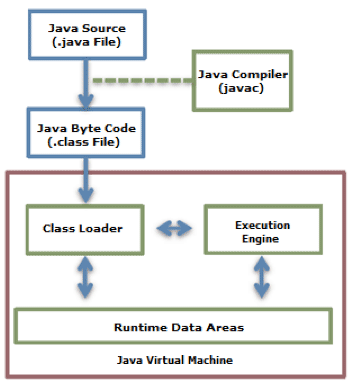
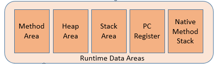
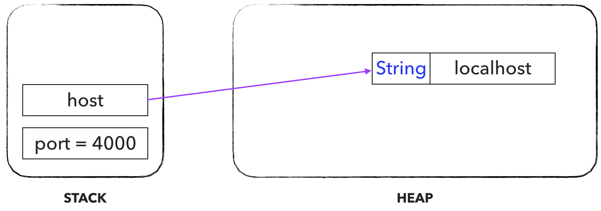

# JVM 메모리 구조 :building_construction:

> 자바에서 프로그램을 실행한다는 것은 컴파일 과정을 통하여 생성된 Class 파일을 JVM으로 로딩하고 ByteCode를 해석하는 과정을 거쳐 메모리 등의 리소스를 할당하고 관리하며 정보를 처리하는 일련의 작업들을 말한다. 이때 JVM은 스레드 관리 및 Grrbage Collection과 같은 메모리 정리 작업도 수행하게 된다.

### 자바 프로그램 수행 과정



- Java Source
  - 사용자가 작성한 Java 코드.
- Java Compiler
  - 자바 소크 파일을 jvm이 해석할 수 있는 java byte code로 변경한다.
- java byte code
  - jvm compiler에 의해 수행된 결과물 --> .class 파일
- class loader
  - jvm 내로 `.class`파일들을 load하여 loading된 클래스들을 runtime data area에 배치한다.
- execution engine
  - loading된 클래스의 bytecode를 해석(interpret)한다.
- runtime data area
  - jvm 이라는 프로세스가 프로그램을 수행하기 위해 os에서 할당 받은 메모리 공간.


### Runtime Data Area



- Method Area = (Class Area)

  - 클래스, 변수, method, static 변수, 상수 정보 등이 저장되는 영역.
    - 클래스 안에 변수, 메소드 등이 다 있으니까 ?
  - class loader의 결과물이 저장되는 곳? == 클래스 파일의 바이트 코드가 로드되는 곳.
  - 모든 스레드가 공유한다.

- Heap Area

  - new 명령어로 생성된 인스턴스와 객체가 저장되는 구역.
  - Garbage Collection 이슈는 이 영역에서 일어난다.
  - 모든 스레드가 공유한다.

- Stack Area

  - method 내에서 사용되는 값들( 매개변수, 지역변수, 리턴값 등)이 저장되는 구역.
  - 메소드가 호출될때 LIFO로 하나씩 생성되고, 메소드 실행이 완료되면 LIFO로 하나씩 지워진다.
  - 각 스레드 별로 하나씩 생성된다.

- PC Register

  - CPU의 register와 비슷한 역할.
  - 현재 수행중인 JVM 명령의 주소값이 저장된다.
  - 각 스레드 별로 하나씩 생성.

- Native Method Stack

  - 다른언어의 메소드 호출을 위해 할당되는 구역으로 언어에 맞게 스택이 형성된다.

    

```java
public class Main {
    public static void main(String[] args) {
        int port = 4000;
        String host = "localhost";
    }
}
```


- 변수인 `port`는 **stack Area**에 저장된다.
- String Object는 **heap**영역에 할당되고 **stack**에 `host`란 이름으로 생성된 변수는 **heap**에 있는 "localhost"라는 스트링을 레퍼런스하게 된다.



<https://yaboong.github.io/java/2018/05/26/java-memory-management/>