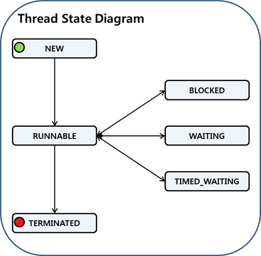
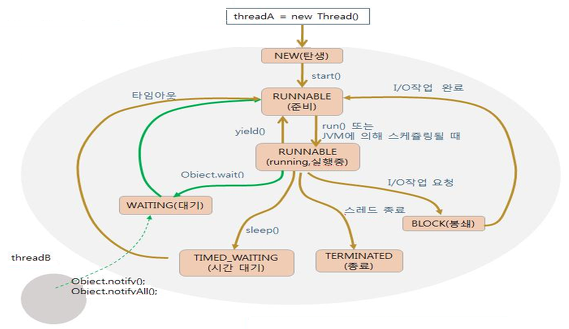
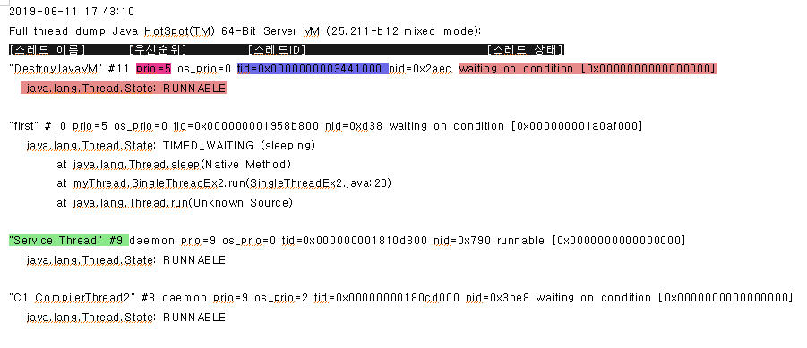
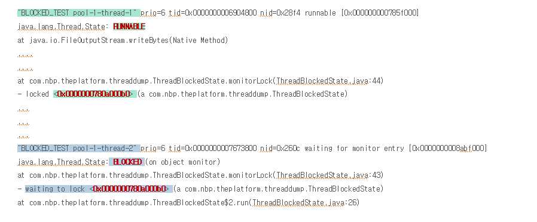

# JVM Sychronization 

> 멀티 스레드 환경에서 공유 자원에 대한 스레드 경합과 동기화에 대해 알아보자.

### 자바와 스레드

WAS에서는 많은 수의 동시 사용자를 처리하기 위해 수십~수백 개의 스레드를 사용한다. 두 개 이상의 스레드가 같은 자원을 이용할 때는 필연적으로 스레드 간에 경합(Contention)이 발생하고 경우에 따라서는 **Dead Lock**이 발생할 수 도 있다.


### 스레드 동기화

> 여러 스레드가 공유자원을 사용할 때, 정합성을 보장하려면 동기화 장치로 **한 번에 하나의 스레드 만 공유 자원에 접근**할 수 있게 해야한다. 자바에서는 **모니터**를 이용해 스레드를 동기화 한다.

- 모든 자바 객체(==인스턴스)는 하나의 **모니터**를 가지고 있다.
- 모니터는 하나의 스레드에 의해서만 소유될 수 있다.
- 특정 스레드가 소유한 모니터를 다른 스레드가 획득하려면 해당 모니터를 소유하고 있는 스레드가 모니터를 해제할 때까지 Wait Queue에서 대기해야 한다.

### Mutual Exclusion ( == 상호 배제)를 하기 위한 동기화

> 둘 이상의 스레드가 동시에 접근하는 것을 막아 주는것. 자바에서는 크게 2가지 방법으로 처리할 수 있다,

- 모든 객체를 대상으로 Lock를 걸 수 있다.  --> 한번에 한 스레드만 객체를 사용하게끔 하는것
- 모든 객체 별로 동기화 처리를 위한 모니터가 결합되어 Lock관리를 수행하게 된다.

- Critical Section
  - 스레드가 동기화가 필요한 지역에 들어가면 동기화를 수행한다. 이 지역을 Critical Section이라고 한다.
  - 스레드가 이 지역에 들어가면 반드시 동기화 작업을 수행한다.
- 스레드가 Critical Section에 진입할 때 동기화를 수행해 Lock를 요청한다.
- Lock을 획득하면 Critical Section에서 작업이 가능하며, Lock획득에 실패하면 Lock을 소유한 다른 스레드가 Lock을 놓을 때까지 대기한다. --> wait set에 들어간다
- Critical Section을 지정해주기만 하면 동기화는 자동으로 된다. 이 영역을 지나면 자동으로 Lock이 풀어 진다.


### 모니터

특정 객체는 하나의 모니터를 가진다. 특정 객체의 모니터에는 동시에 하나의 스레드 만이 들어갈 수 있다. 다른 스레드에 의해 이미 점유된 모니터에 들어가고자 하는 스레드는 모니터의 **wait set**에서 대기한다.

자바에서 모니터를 **점유**하는 유일한 방법은 **Synchronized **키워드를 사용하는 것이다. 


1. Synchronized Statement

   ```java
   public class syn1 extends Thread {
   	private int[] arr = new int[10];
   
   	public void run() {
   		synchronized(this) {
   			for(int i=0 ; i<arr.length; ++i) {
   				arr[i] = i ;
   				System.out.println(arr[i]);
   			}
   		}
   	}
   
   	public static void main(String[] args) {
   		new syn1().run();
   	}
   }
   ```

   해당 Object ( 여기서는 arr )에 대해 모니터를 점유하려는 모든 스레드는 for구문이 실행되는 동안 대기 상태에 빠지게 된다.

2. synchronized Method

   ```java
   synchronized void syncMethod(){
       for(int i=0 ; i<arr.length; ++i) {
   				arr[i] = i ;
   	}
   }
   ```

   함수에 들어가는 순간 critical Section에 들어가게 된다.

   메소드 블럭 전체에 락을 거는 방법으로 메소드에 진입하기 위해서는 메소드를 호출하는 인스턴스의 락을 획득해야 메소드에 진입할 수 있다. 해당 메소드 블럭을 벗어나게 되면 획득한 락을 반환한다.


### Wait 와 Notify

> 무작정 Lock을 선점한 스레드가 Lock을 내놓는 것을 기다리는 것은 상당히 비효율적이다. 이것을 해결하기 위해 나왔다.

- wait와 notify는 동기화된 블록안에서 사용해야 한다.
- 해당 객체의 락에대한 권한을 가지고 있는 쓰레드가 wait()를 만나게 되면 권한을 놓고 대기하게 된다. --> Wait Set으로 간다.
- 이때 notify()를 요청한 스레드는 권한을 얻고, 원하는 수행을 한다. 이 스레드가 권환을 다시 돌려주지 않으면 잠시 Entry Set으로 간 스레드는 권한을 다시 못 가지게 될 수 있다.


### 결과를 예측해 보자

```java
public class ThreadB extends Thread {

     int total;
     @Override
     public void run(){
         synchronized(this){
             for(int i=0; i<5 ; i++){
                 System.out.println(i + "를 더합니다.");
                 total += i;
                 try {
                     Thread.sleep(500);
                 } catch (InterruptedException e) {
                     e.printStackTrace();
                 }
             }
             notify();
   
         }
     }
}
```

### #1 Case

```java
public class ThreadA {
	public static void main(String[] args){

        ThreadB b = new ThreadB();
        b.start();

        synchronized(b){
            System.out.println("Total is: " + b.total);
        }
    }
}
```

### #2 Case

```java
public class ThreadA {
	public static void main(String[] args){

        ThreadB b = new ThreadB();
        b.start();

        synchronized(b){
            b.wait();
            System.out.println("Total is: " + b.total);
        }
    }
}
```

:arrow_forward: main 스레드의 함수가 b.start()보다 먼저 실행하게 되고 먼저 권한을 가진다.


### notify 와 notifyAll

- notify는 객체의 권한을 가질 스레드를 JVM의 정책에 의해 결정되는 것이다. 따라서 개발자는 어떤 스레드가 권한을 가지게 될지 알 수 없다.
- notifyAll은 모든 Wait Set에 있는 권한을 가지고자 하는 스레드끼리 경합을 붙이게 하는것. 이 중 한 스레드만이 권한을 가지고 나머지 스레드는 다시 잠들게 된다.

**:pushpin:Synchronized 키워드를 사용하는 작업은 오버헤드를 따른다. 반드시 필요한 경우에만 사용해야 한다.**

요즘은 성능을 위해 아예 사용하지 않는 추세라고 한다.


---

---


## Thread 상태

Thread의 상태는 `Java.lang.Thread` 클래스 내부에 `State`라는 이름을 가진 `Enum`으로 선언되어 있다.



- new

  새로운 스레드. 스레드가 생성됐지만, 아직 실행되지 않은 상태

- runnable

  현재 CPU를 점유하고 작업을 수행중인 상태.  운영체제의 자원 분배로 인해 waiting 상태가 될 수도 있다.

- blocked

  monitor를 획득하기 위해 다른 스레드가 락을 해제하기를 기다리는 상태

- waiting

  wait() 메서드, join() 메서드, park() 메서드 등에 의해서 대기하고 있는 상태.

  객체가 notifyall()을 했음에도 권한을 가지지 못하면 blocked 상태가 된다.

- timed_waiting

  sleep(), wait(), join(), park() 메서드 등을 이요해 대기하고 있는 상태.

  - waiting 상태와의 차이점은 메서드의 인수로 최대 대기 시간을 명시할 수 있어서, 외부적인 변화 뿐만 아니라 **시간**에 의해서도 waiting 상태가 해제될 수 있다는 것이다.

- terminated

  종료된 상태. 실행을 모두 마치거나 stop()이 호출되면 스레드는 소멸된다.




### 스레드의 종류 : 데몬 스레드와 비데몬 스레드

사용자가 직접 스레드를 생성하지 않더라도, JAVA 어플리케이션이 기본적으로 여러개의 스레드를 생성한다. 대부분이 **데몬 스레드**인데 가비지 컬렉션이나 JVM등의 작업을 처리하기 위한 것이다.

**`'static void main(String[] args)'` **메서드가 실행되는 스레드는 비 데몬 스레드로 생성되고 이 스레드가 동작을 중지하면 다른 데몬 스레드도 같이 동작을 중지하게 된다. 사용자가 명시적으로 이 메인 메서드를 실행하지 않더라도 JVM은 하나의 **메인 스레드**를 생성해서 어플리케이션을 구동한다.

비데몬 스레드에는 `Java.lang.Thread`를 상속받거나 `Java.lang.Runnable` 인터페이스를 구현함으로써 만들어 진다.


#### :pushpin:데몬 : Daemon

사용자가 직접적으로 제어하지 않고, 백그라운드에서 돌면서 여러 작업을 하는 프로그램.


### 스레드 덤프

자바에서는 스레드 동기화 문제를 분석하는 가장 기본적인 방법으로서, 스레드 덤프를 통해 분석한다.

```java
public class SingleThreadEx2 implements Runnable{

    private int[] temp;
	
    public SingleThreadEx2(){
	temp = new int[10];
		
	for(int start=0;start<temp.length;start++){
		temp[start]=start;
	}
    }
	
    @Override
    public void run() {
        // TODO Auto-generated method stub
        for(int start:temp){
            try {
                Thread.sleep(1000);

            } catch (InterruptedException ie) {
                ie.printStackTrace();
                // TODO: handle exception
            }

            System.out.println("==>:"+Thread.currentThread().getName());
            System.out.println("temp value :"+start);
        }
    }
	
    public static void main(String[] args) {

        SingleThreadEx2 ct = new SingleThreadEx2();
        Thread t = new Thread(ct,"first");

        t.start();
    }
}
```

:arrow_double_up: 의 스레드 덤프 :arrow_double_down:



**first**라는 이름을 가진 스레드가 **runnable**하고 있는 상태로 `java.lang.Thread.sleep()`라는 메소드가 실행 중이다.


**사용 예)**



thread2는 thread1가 락을 소유한 객체를 락이 풀리기를 **waiting**하고 있다.


## 스레드 덤프를 이용한 문제 해결

### 1. CPU 사용률이 비 정상적으로 높을 때

어플리케이션을 수행할 때, CPU 사용률이 비정상적으로 높다면 스레드 덤프를 확인해 보자.

CPU를 가장 많이 점유하는 스레드가 무엇인지 추출한다. 해당 스레드가 필요한 작업을 수행하는지, 처리하는 일에 비해 과도하게 CPU를 사용하지 않는지 확인하며 대처할 수 있다.

### 2. 수행 성능이 비 정상적으로 느릴 때

어플리케이션의 수행 성능이 비정상적으로 느릴때는 **BLOCKED**상태인 스레드가 원인이 경우가 많다. 이 때에는 스레드 덤프를 여러번 얻은 다음 **BLOCKED** 상태인 목록을 찾고 스레드가 획득하고자 하는 락과 관련된 스레드를 추출해 보자.

\<https://d2.naver.com/helloworld/10963>